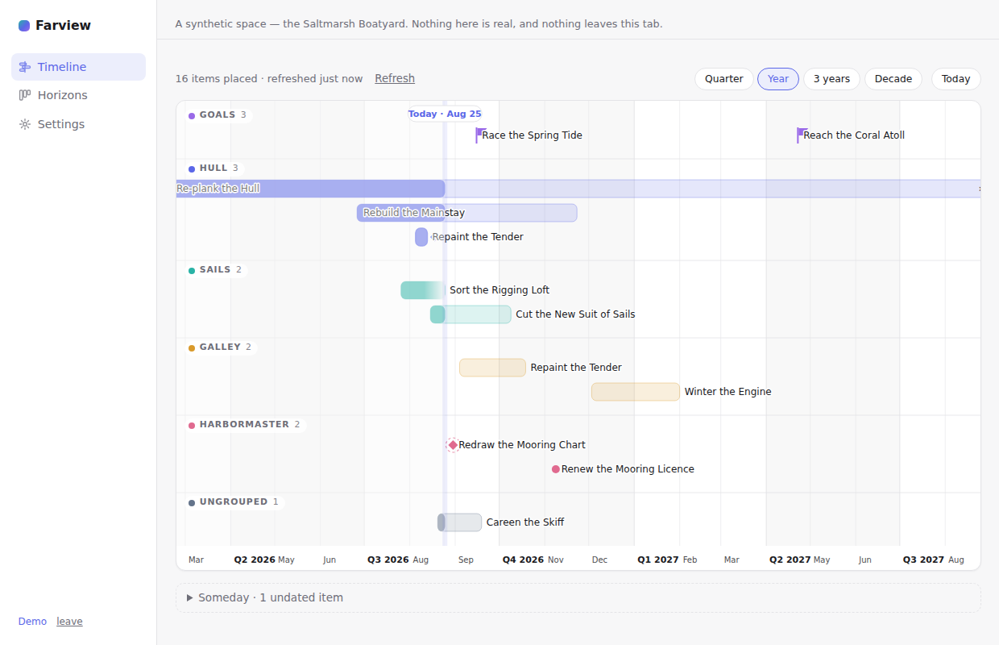
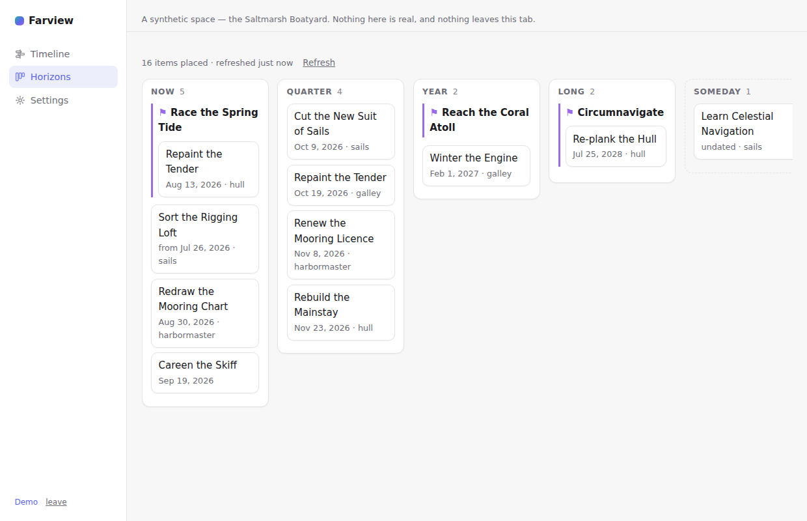

# Farview

**See your goals across time, in Capacities.**



> **Disclaimer:** Farview is an independent community tool. It is not affiliated with, endorsed by, or sponsored by Capacities. Capacities is a trademark of its respective owners.

Notes are where plans get written, and where they quietly lose their shape: Capacities has no timeline, no Gantt view, no canvas — so the question "what does my year actually look like?" has no answer short of moving everything into a project manager. Farview answers it in place. Connect a space, and your projects and goals appear on a timeline — a single line marking today, bars stretching toward their targets, and one smooth zoom from this quarter out to the shape of your decade.

## Read-only, and proud of it

Farview requests **`api:read` and nothing else**. It cannot create, modify, or delete anything in your space, and the OAuth consent screen will show you exactly that. This is the product's identity, not a limitation: every card deep-links into Capacities, where the real editing happens, and any feature that would need write access simply doesn't get built.

You can revoke Farview's access at any time in Capacities under **Settings → Capacities API → Connections**.

## No backend, no telemetry

The site is plain static files. OAuth happens in your browser, the token stays in your browser, and every API call goes from your browser straight to `api.capacities.io`. There is no server, no database, no account, no analytics, and no tracking — nothing of yours passes through anything the maintainer controls, because there is nothing to pass through.

Honest tradeoff, stated rather than hidden: browser-stored tokens are reachable by any script that runs on the page. That is why Farview bundles everything, loads no third-party scripts, and ships a strict Content-Security-Policy (enforced by a test). The blast radius is also smaller than for most tools — the token is read-only.

## Works with *your* object types, not mine

Farview has no idea what a "Project" is until you tell it. Setup reads your space's **actual** types and properties — whatever you named them — and asks three questions: which type holds your work, which property is the start date, which is the target. A Goal type is optional (most spaces have none), milestones are optional, grouping by tag or property is optional. The live preview renders your real timeline before you save anything.

- **Horizons are derived from dates** — Now, Quarter, Year, Long — so a space with zero custom setup still gets a meaningful view. Spaces with an explicit horizon property can use their own labels instead.
- **Undated items are never dropped.** They wait, visibly, in a Someday tray.
- **Progress bars show elapsed time, not completion percent** — elapsed vs. remaining is a fact; percent-complete on a personal goal is a fiction.
- **Nothing turns red.** Work past its target gets a quiet marker and a matter-of-fact note.



## Getting started

1. Visit the site and click **Connect to Capacities**. You approve read access and pick which space to share — all on the Capacities side.
2. Map your space: pick your project type, its date properties, and (optionally) goals, milestones, and grouping. The preview shows your real timeline as you go.
3. Save. That's it — the timeline and horizons views work from the same data, on desktop and phone.

No account is needed to look around: **Try the demo** runs on a synthetic space, entirely in your tab.

### Try it today with a personal token

Until the hosted OAuth client is live (registration with Capacities is by email), you can run Farview against your own space with a personal API token: in Capacities, **Settings → Capacities API** → create a token (read access is all Farview needs), then use the *Advanced* section on the connect screen. The token stays in your browser; revoke it in the same settings screen whenever you like.

## Built on the official API

Farview uses the official Capacities API and the `@capacities/api` SDK — not the app's internal endpoints, which change without warning. Dates live in object properties, and list endpoints return summaries only, so Farview fetches objects individually behind a progressive renderer: the axis and now-line paint immediately, bars fill in as they arrive, everything is cached in your browser (default 60 minutes) with a visible "last refreshed" and a manual refresh, and large spaces are capped per run with a "load more".

## Deploying your own

```
npm install
VITE_CAPACITIES_CLIENT_ID=your-client-id npm run build
```

The output in `dist/` is a static site — any static host works, no server functions needed. `/`, `/app/`, and `/callback/` are real directories, so no rewrite rules are required. The client id is public by design (PKCE public client; no client secret exists). Register your own redirect URI with Capacities by email — see [developers.capacities.io](https://developers.capacities.io).

## Development

```
npm install
npm run dev     # local dev server
npm test        # vitest, node environment — no browser needed
npm run build   # typecheck + production build
```

The test suite runs the whole engine and fetch pipeline against synthetic fixture spaces — see [CONTRIBUTING.md](CONTRIBUTING.md) for the rules that are treated as build failures.

Farview looks forward. Its sibling, [Yesteryear](https://github.com/saj-sudo/yesteryear), looks back — resurfacing your older notes on a gentle cadence. They share an architecture, not a codebase.

## License

[MIT](LICENSE).
